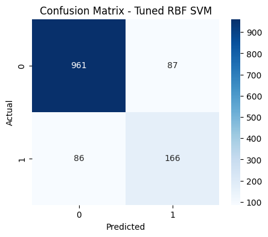
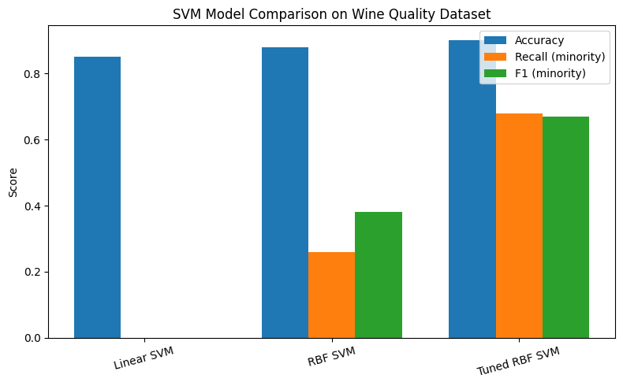

# 🍷 Wine Quality Classification using Support Vector Machines (SVM)

## 📌 Project Overview
This project applies **Support Vector Machine (SVM)** models to predict wine quality based on physicochemical properties.  
The dataset is sourced from the [UCI Machine Learning Repository – Wine Quality](https://archive.ics.uci.edu/dataset/186/wine+quality) and includes both **red and white wines**.

---

## 🎯 Objectives
- Classify wines as **good (≥7)** or **not good (<7)** quality.  
- Compare performance across:
  - Red wine dataset
  - White wine dataset
  - Combined dataset (with `wine_type` feature)
- Explore how kernel choice and hyperparameter tuning affect results.  
- Handle **class imbalance** and evaluate using metrics beyond accuracy.

---

## 📊 Dataset Information
| Dataset | Samples | Features | Target |
|----------|----------|-----------|----------|
| Red wine | 1,599 | 11 physicochemical features | Quality (score 0–10) |
| White wine | 4,898 | 11 physicochemical features | Quality (score 0–10) |
| Combined | ~6,500 | 12 (after encoding `wine_type`) | Binary: good (1) / not good (0) |

**Feature Examples:**  
- Fixed acidity  
- Volatile acidity  
- Citric acid  
- Residual sugar  
- Density  
- Alcohol  
- Sulphates  
- pH  

---

## 🧠 Methods

### 1. Data Preprocessing
- Combined red & white datasets and added a categorical feature `wine_type`.  
- Converted `quality` to binary:
  ```python
  wine["label"] = (wine["quality"] >= 7).astype(int)
- Scaled numerical features using StandardScaler.
- Stratified train-test split (80/20).

### 2. Model Development
Three main experiments were conducted:
1. Linear SVM (Baseline)
2. RBF SVM (Default)
3. RBF SVM (Tuned)

### 3. Hyperparameter Tuning
- Used `GridSearchCV` to search over :
  ```python
  param_grid = {
    'svm__C': [0.1, 1, 10, 100],
    'svm__gamma': [0.01, 0.1, 1]
  }

---

## 🧩 Evaluation Metrics
- Accuracy – overall correctness of predictions
- Precision – reliability of positive predictions
- Recall – ability to find all actual positives
- F1-score – harmonic mean of precision & recall

---

## 📈 Results
### Model Comparison (Red Wine)

| Model             | Accuracy | Recall (minority) | F1 (minority) |
| ----------------- | -------- | ----------------- | ------------- |
| Linear SVM        | 0.85     | 0.00              | 0.00          |
| RBF SVM (default) | 0.88     | 0.26              | 0.38          |
| RBF SVM (tuned)   | **0.90** | **0.68**          | **0.67**      |

### Model Comparison (White Wine)
| Model             | Accuracy | Recall (minority) | F1 (minority) |
| ----------------- | -------- | ----------------- | ------------- |
| Linear SVM        | 0.87     | 0.04              | 0.08          |
| RBF SVM (default) | 0.89     | 0.33              | 0.48          |
| RBF SVM (tuned)   | **0.92** | **0.61**          | **0.69**      |

### Model Comparison (Combined Dataset)
| Model             | Accuracy | Recall (minority) | F1 (minority) |
| ----------------- | -------- | ----------------- | ------------- |
| Linear SVM        | 0.86     | 0.02              | 0.04          |
| RBF SVM (default) | 0.89     | 0.29              | 0.43          |
| RBF SVM (tuned)   | **0.91** | **0.65**          | **0.71**      |

---

## 🎨 Visualization

### 🔎 Confusion Matrix


### 📊 Model Comparison

